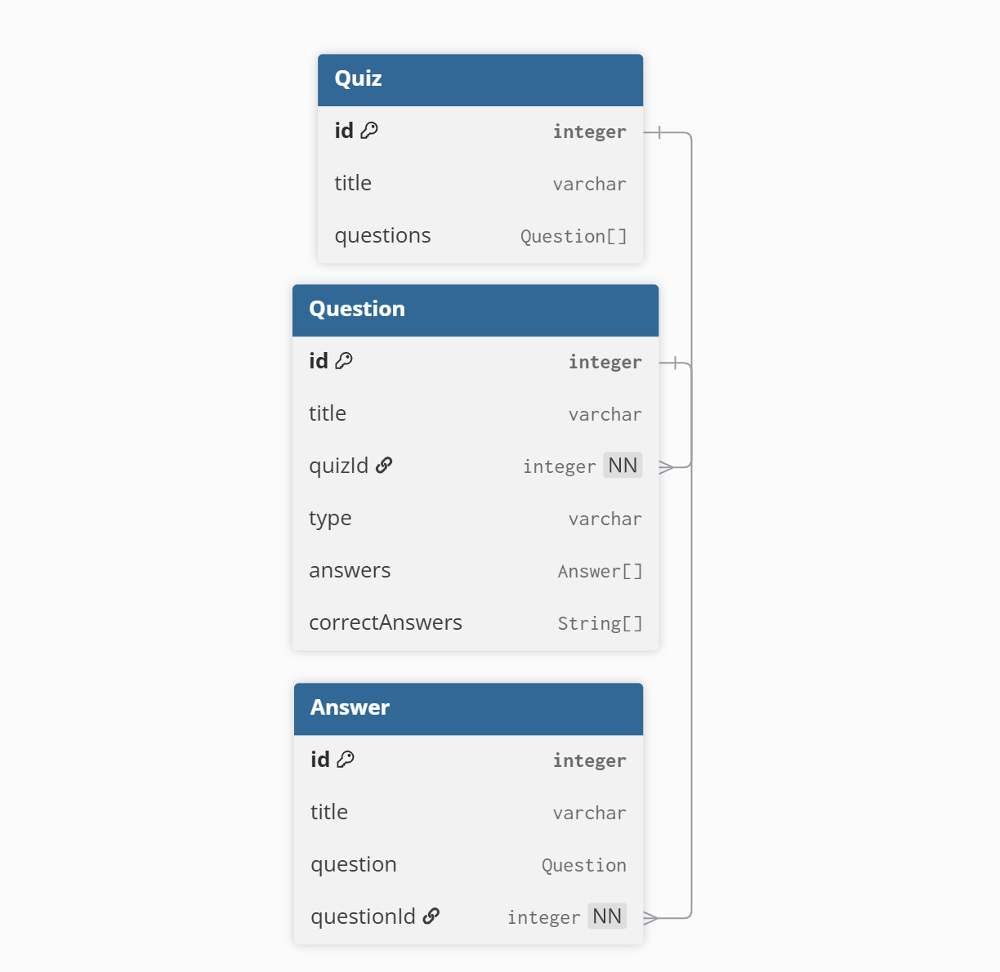

# Quiz Builder – Database Schema

This project uses **PostgreSQL + Prisma**.  
Below are the main entities and their relationships.

---

## Entities

### Quiz

```prisma
model Quiz {
  id        Int        @id @default(autoincrement())
  title     String
  questions Question[]
}
```

- Represents a quiz
- Has many Question

### Question

```prisma
model Question {
  id        Int       @id @default(autoincrement())
  title     String
  type      String
  quiz      Quiz      @relation(fields: [quizId], references: [id])
  quizId    Int
  answers   Answer[]
}
```

- Belongs to a Quiz
- Has a type (BOOLEAN, TEXT, MULTIPLE_CHOICE, etc.)
- Can have multiple Answer

### Answer

```prisma
model Answer {
  id         Int      @id @default(autoincrement())
  title      String
  question   Question @relation(fields: [questionId], references: [id])
  questionId Int
}
```

- Belongs to a Question
- Represents a possible answer (empty for TEXT/BOOLEAN questions)

### Diagram


